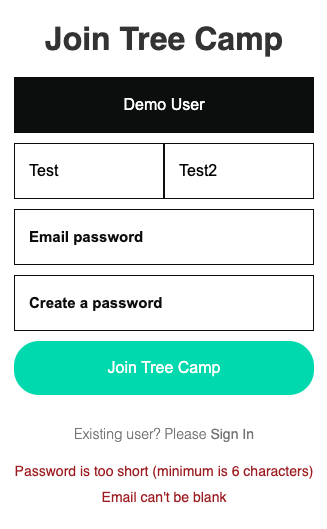
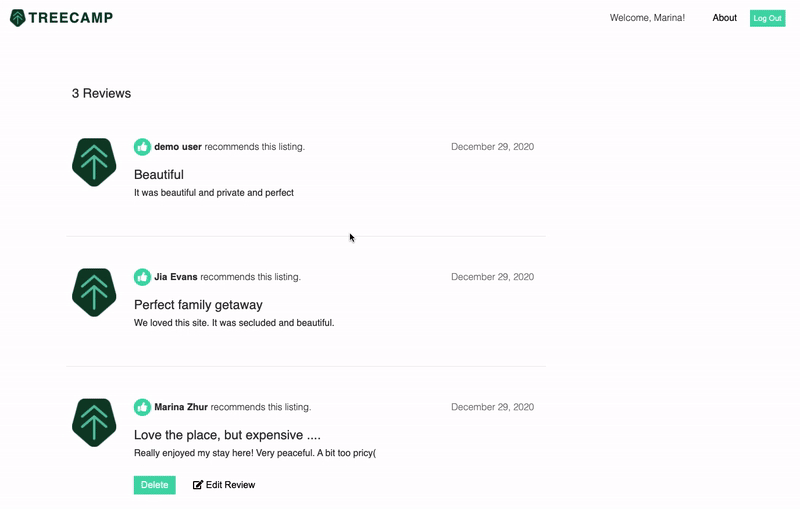
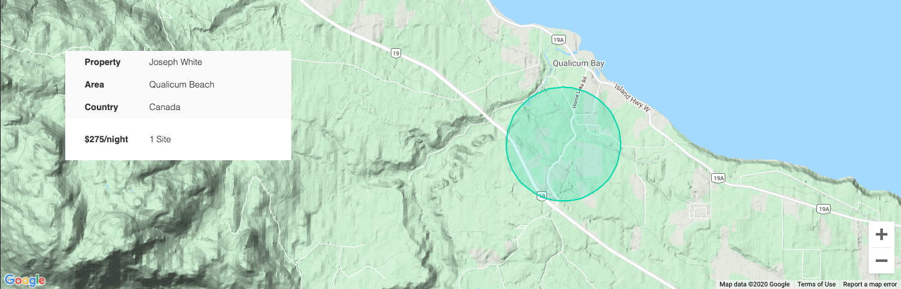
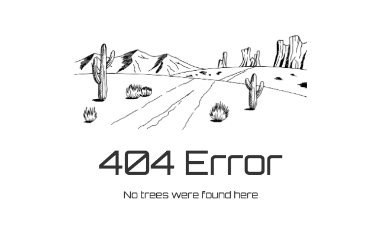

# TREECAMP
[TREECAMP](https://tree-camp.herokuapp.com/#/ "TeeCamp Homepage") is the best platform to explore, search and book the most unique treehouses all over the world. 

<p>&nbsp;</p>
<div align="center">
  <a href="https://tree-camp.herokuapp.com/#/"></a>
</div>

## Table of Contents 

- [Technologies](#technologies)
- [Features](#features)
  * [User Authentication](#user-authentication)
  * [Sites](#Sites)
  * [Bookings](#bookings)
  * [Reviews](#reviews)
  * [Maps](#maps)
  * [Page Not Found](#page-not-found)
- [Future Upgrades](#future-upgrades)
- [Future Upgrades](#future-upgrades)

## Background and Overview
### Technologies
- Javascript
- Ruby, Ruby on Rails
- HTML5
- CSS
- React, Redux
- Google Maps API
- AWS S3

<div align="center">
  <a href="https://tree-camp.herokuapp.com/#/"></a>
</div>

### Features
- Users can login, signup or explore the site as demo users.
- Password is encrypted with BCrypt for security 
- Only logged in users are able to book treehouses(sites). 
- Users can preview their existing bookings on bookings index page.
- Users can delete and edit their bookings on bookings index page.
- Logged in users can leave a review for the site and edit/delete their review.
- Visitors can browse treehouses and see features and details.
- Sites are displayed with Google Maps API.

<div align="center">
  <a href="https://tree-camp.herokuapp.com/#/"></a>
</div>

#### User Authentication
- BCrypt is utilized for account security. Only logged in users are able to access all website features. Modals are used to simplify users experience.
<div>
  
</div>
<p>&nbsp;</p>
-Rails backend Active Record validations are used to monitor user credentials and deliver error messages to advise the user.
<div>
  
</div>
<p>&nbsp;</p>
<div align="center">
  <a href="https://tree-camp.herokuapp.com/#/"></a>
</div>

#### Sites
- Visitors can browse treehouses(sites). They can view site information, essentials, amenities, available activities, read the reviews and see the site location on Google Map
<div >
  
</div>
<p>&nbsp;</p>
<div align="center">
  <a href="https://tree-camp.herokuapp.com/#/"></a>
</div>

#### Bookings
- Logged in or demo users can book a tree house. Checkin, checkout dates and number of guests must be provided. On successful booking, a user is redirected to the bookings index page.
- All bookings are displayed on booking index page. User can edit or delete exosting booking.
<div>
  
</div>
<p>&nbsp;</p>
<div align="center">
  <a href="https://tree-camp.herokuapp.com/#/"></a>
</div>

#### Reviews
- On the spot show page, logged in users can write, delete or edit their reviews. Spot rating is dynimically updated based on the average reviews rating
<div>
  
</div>
<p>&nbsp;</p>
<div align="center">
  <a href="https://tree-camp.herokuapp.com/#/"></a>
</div>

#### Maps
- After selecting desired destination from the search bar, new page with available sites is rendered. Sites are marked on Google Map with google.maps.Marker. Additional site information is available on marker hover.  
- The second location of Google Maps is on the bottom of the spot show page. Site information summary is provided for reference.
<div>
  
</div>
<p>&nbsp;</p>
<div>
  
</div>
<p>&nbsp;</p>
<div align="center">
  <a href="https://tree-camp.herokuapp.com/#/"></a>
</div>
<p>&nbsp;</p>

#### Page Not Found
- Users will be redirected to 404 Not Found page when type non-existing url.
<div>
  
</div>
<p>&nbsp;</p>
<div align="center">
  <a href="https://tree-camp.herokuapp.com/#/"></a>
</div>
<p>&nbsp;</p>

### Code Highlights
- Code below demonstrates how the spot rating is updated after the user writes a new review.
```javascript
handleSubmit(e){
    e.preventDefault();
    this.props.createReview(this.state)
      .then(() => {
          this.setState({
              title: '',
              body: '',
              rating: 0
          })
      }).then(()=>{
          this.updateRating();
      })
}

updateRating(){
    let newRating = 0
    let revSum = 0;
    this.props.fetchReviews(this.props.spot.id)
      .then((res) => {
          let revNum = Object.values(res.reviews).length;

          Object.values(res.reviews).forEach((review) => {
              revSum += parseInt(review.rating);
          })

          newRating = (revSum / revNum).toFixed(1);
          const spotEdit = Object.assign({}, this.props.spot, { rating: newRating * 10 });
          this.props.updateSpot(spotEdit)
      })
}
```
<p>&nbsp;</p>

### Future Upgrades
- Improve search functionality.
- Allow users to create/add their treehouses
