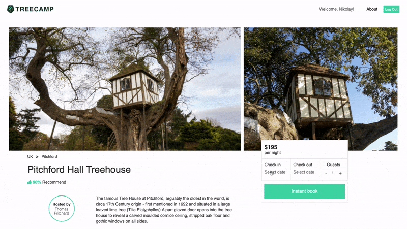

# TREECAMP

[TREECAMP](https://tree-camp.herokuapp.com/#/ "TeeCamp Homepage") is the best platform to explore, search and book the most unique treehouses all over the world. 

  

## Table of Contents 

- [Technologies](#technologies)
- [Features](#features)
  * [User Authentication](#user-authentication)
  * [Sites](#Sites)
  * [Bookings](#bookings)
  * [Reviews](#reviews)
  * [Maps](#maps)
- [Future](#future)

## Background and Overview
### Technologies
- Javascript
- Ruby, Ruby on Rails
- HTML5
- CSS
- React, Redux
- Google Maps API
- AWS S3

  

### Features
- Users can login, signup or explore the site as demo users.
- Password is encrypted with BCrypt for security 
- Only logged in users are able to book treehouses(sites). 
- Users can preview their existing bookings on bookings index page.
- Users can delete and edit their bookings on bookings index page.
- Logged in users can leave a review for the site and edit/delete their review.
- Visitors can browse treehouses and see features and details.
- Sites are displayed with Google Maps API.

  

#### User Authentication
- BCrypt is utilized for account security. Only logged in users are able to access all website features. Modals are used to simplify users experience.

  

&nbsp;

  

#### Sites
- Visitors can browse treehouses(sites). They can view site information, essentials, amenities, available activities, read the reviews and see the site location on Google Map

  

&nbsp;

  

#### Bookings
- Logged in or demo users can book a tree house. Checkin, checkout dates and number of guests must be provided. On successful booking, a user is redirected to the bookings index page.

  

&nbsp;

  

